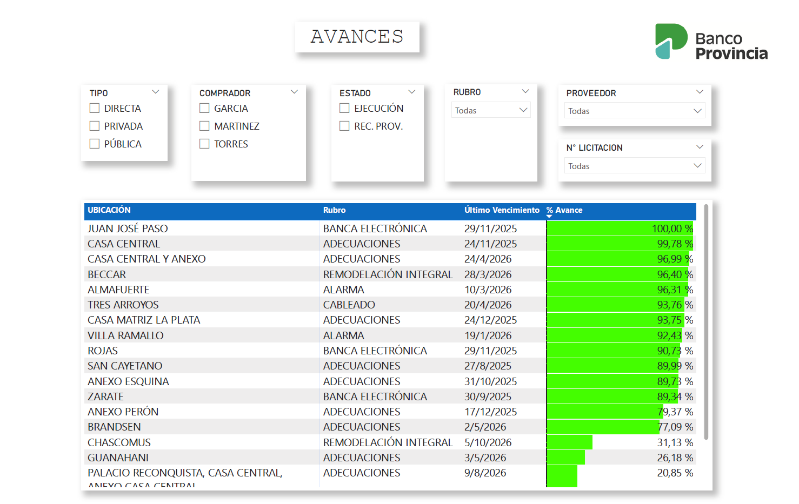

# Construction Project Tracking Dashboard – Power BI

## Overview
Power BI dashboard designed to monitor and control construction and renovation 
projects across multiple locations. Provides a structured view of project status, 
timelines, contract amounts, and progress percentages to support decision-making 
and operational oversight.

## Features
- Project status tracking (In Progress / Provisional Reception / Complete)
- Contract amount and budget control per project
- Progress percentage by location and type
- Deadline and delay monitoring
- Interactive filters by buyer, type, category and location

## Tools
- Power BI Desktop
- Microsoft Excel (data source)

## Data Notice
The data used in this dashboard has been modified to protect confidentiality. 
All names, amounts, and identifiers have been replaced with fictitious values 
while preserving the original structure and format.

## How to use
1. Download the full repository
2. Place the `.pbix` and `.xlsx` files in the same folder
3. Open the `.pbix` file in Power BI Desktop
4. If prompted, reconnect the data source to the `.xlsx` file in your folder
5. Refresh the data

## Files
- `obras_dashboard.pbix` — Power BI report
- `obras_data.xlsx` — Sample dataset (anonymized)
- `obras_preview.pdf` — Dashboard preview (no Power BI required)

## Preview
